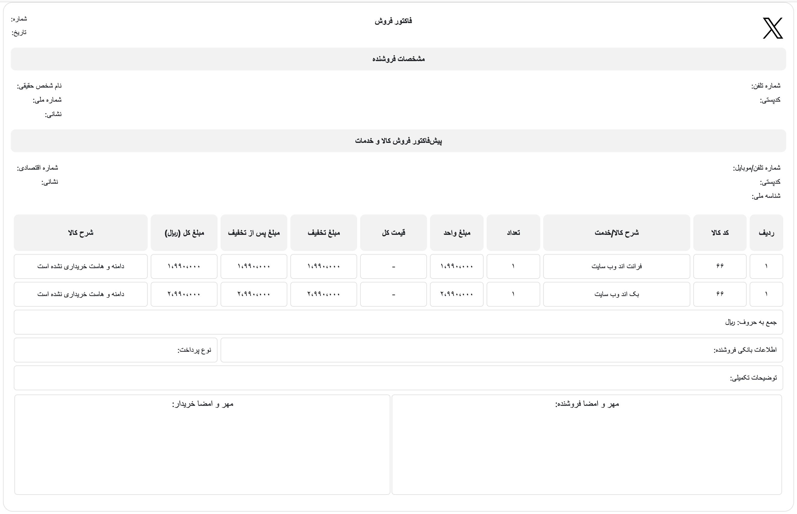
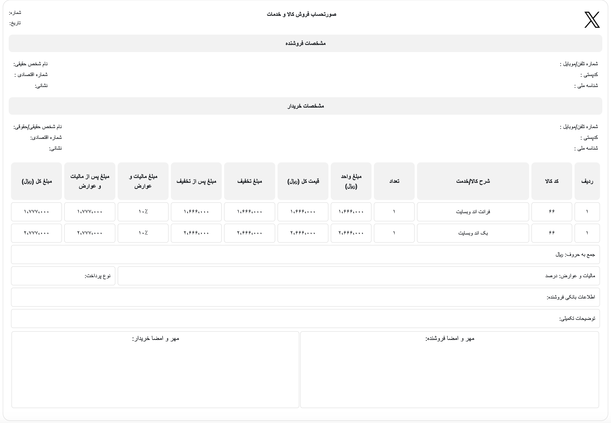
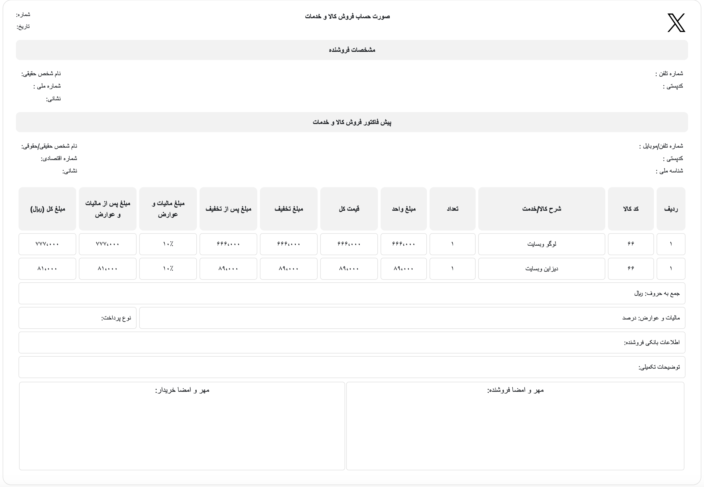

# Finanacial Factor Template 

If you need a financial factor template for your website or project, you can use this project… :)

## Features:

Here I create 3 financial factor templates (Official — Informal — Personal) for you.
Languages: Pure HTML, SCSS, Bootstrap

# Demo's

<h2>Factor Informal</h2>

<h2>Factor Personal</h2>

<h2>Factor Official</h2>

## Report Some Bugs
Find a Bug? Please, [create an issue,](https://github.com/YasinDehfuli/Financial-Factor-Template/issues/new) and we'll fix it together for a better template.

## Contribution
Contributions are always welcome and recommended! Here is how:

- Fork the repository ([here is the guide](https://help.github.com/articles/fork-a-repo/)).
- Clone to your machine git clone https://github.com/YOUR_USERNAME/Web-Package-RTL.git
- Make your changes
- Create a pull request

## License

[GPL](https://www.gnu.org/licenses/gpl-3.0.en.html)

 Developed With Love For Iranian's ! ❤️

